# Micro-course: Introduction to Git & GitHub

> **Author:** Albert Hernansanz (<albert.hernansanz@upf.edu>), Universitat Pompeu Fabra  
> **Testers:** Joana Gutiérrez & Mia Insa, UPF Eng. Student  
> **Course:** Introduction to Programming, UPF  
> **Goal:** Brief practical introduction to Git (with use of GitHub)  
> **Format:** Self-paced pre-session + guided hands-on session  
> **Version:** 5.2

> **Original Repository:** https://github.com/alberthp/Micro-course-Introduction-to-Git-GitHub.git

---

<a id="contents"></a>

## Contents

**Part 1: Pre-session (before class)**

- [1. What is a code repository?](#1-what-is-a-code-repository)
- [2. Why is this important?](#2-why-is-this-important)
- [3. Create your GitHub account](#3-create-your-github-account) 🔧
- [4. Install Visual Studio Code](#4-install-visual-studio-code) 🔧
- [5. Install Git](#5-install-git) 🔧

**Part 2: Hands-on session**

- [6. Create a private repository](#6-create-a-private-repository) 🔧
- [7. Invite a classmate as collaborator](#7-invite-a-classmate-as-collaborator) 🔧
- [8. Folder structure of a Git project](#8-folder-structure-of-a-git-project)
- [9. Download a local copy (clone)](#9-download-a-local-copy-clone) 🔧
- [10. The Git pipeline: how changes travel](#10-the-git-pipeline-how-changes-travel)
- [11. Create your first file](#11-create-your-first-file) 🔧
- [12. Your first commit and push](#12-your-first-commit-and-push) 🔧
- [13. Modify, diff, and commit again](#13-modify-diff-and-commit-again) 🔧
- [14. Practice: complete the pipeline yourself](#14-practice-complete-the-pipeline-yourself) 🔧
- [15. Branches](#15-branches) 🔧
- [16. Common problems](#16-common-problems)
- [17. Working with teams](#17-working-with-teams) 🔧

**Reference**

- [Summary: essential commands](#summary-essential-commands)
- [Good practices](#good-practices)

**Additional material**

- [A. The .gitignore file: what NOT to track](#a-the-gitignore-file-what-not-to-track)
- [B. GitHub Desktop and VS Code extensions](#b-github-desktop-and-vs-code-extensions)
- [C. Cross-platform line endings (CRLF vs LF)](#c-cross-platform-line-endings-crlf-vs-lf)
- [E. Authentication troubleshooting](#e-authentication-troubleshooting)
- [F. Pull Requests on GitHub](#f-pull-requests-on-github)
- [G. Advanced recovery commands](#g-advanced-recovery-commands)
- [D. GitHub Student Developer Pack benefits](#d-github-student-developer-pack-benefits)

> 🔧 = sections where you must do something on your computer.

## How this course is organized

| Part | What you will do |
| ------ | ------ | ----------------- |
| **Part 1: Pre-session** | Understand what a repository is, create your GitHub account, install the tools |
| **Part 2: Hands-on session** | Create a repo, clone it, edit code, push, branch, merge, collaborate |

[↑ Back to contents](#contents)

---

# Part 1: Pre-session: environment setup

---

## 1. What is a code repository?

A **repository** (or **repo**) is a folder that contains your project files **plus the complete history of every change** ever made to those files.

Think of it as a project folder with a built-in time machine: you can go back and recover any previous version, see who changed what and when, and work with other people without overwriting each other's work.

**Important:** changes you make to files are not automatically part of Git history. You must explicitly tell Git which changes to record (this is covered in section 10).

There are two copies of a repository:

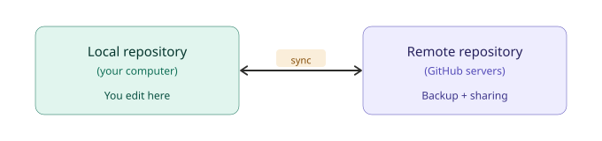

- **Local**: lives on your computer. You write code here.
- **Remote**: a copy of the repository stored on another server (such as GitHub). It lets you synchronize work between computers and collaborate with others.

**Git** is the tool that manages the history and synchronization. It runs on your computer.  
**GitHub** is the website that hosts the remote copy and adds collaboration features (permissions, code review, issue tracking).

| | Git | GitHub (and other services) |
| --- | --- | --- |
| What is it | Software (command-line tool) | Website and cloud service |
| Where it runs | Your computer | Remote servers |
| Main purpose | Track change history | Host repos and manage collaboration |
| Cost | Free, open source | Free tier (enough for this course) |
| Required | Yes | Yes (for this course) |

> **Analogy (simplified):** Git is like a word processor (runs on your machine). GitHub is like Google Drive (stores and shares your files online). This comparison is intentionally simple: unlike Google Drive, GitHub does not just store files; it hosts full Git repositories with history and collaboration features.


[↑ Back to contents](#contents)

---

## 2. Why is this important?

### The "definitive" problem

Imagine you are working on a lab assignment with a classmate. After a few days, your project folder looks like this:

```
lab_project/
├── lab.cpp
├── lab_v2.cpp
├── lab_final.cpp
├── lab_final_FINAL.cpp
├── lab_definitive.cpp
├── lab_definitivedefinitive.cpp
├── lab_definitive2.cpp
├── lab_deliverable.cpp
├── lab_deliverable_FIXED.cpp
└── lab_deliverable_FIXED_user2.cpp
```

Now answer these questions:

1. **Which file is the real last version?** You don't know. Nobody knows.
2. **What changed between `lab_final.cpp` and `lab_definitive.cpp`?** You would have to open both and compare them line by line.
3. **Your classmate edited `lab_definitive.cpp` while you edited `lab_definitive2.cpp`.** Which one has the correct changes? Both? Neither?
4. **You accidentally deleted a function that worked yesterday.** How do you get it back? You can't, unless you kept a separate copy.

### What Git solves

With Git, **you have one file** (`lab.cpp`), and Git keeps the full history of every change internally:

```
lab.cpp
  ├── commit 1: "Initial version"           (Sept 10, 14:00)
  ├── commit 2: "Add input validation"       (Sept 10, 16:30)
  ├── commit 3: "Fix loop bug"               (Sept 11, 09:15)
  ├── commit 4: "Add output formatting"      (Sept 11, 11:00)
  └── commit 5: "Final version for delivery" (Sept 12, 08:45)
```

- You always know which is the latest version (the last commit).
- You can see exactly what changed between any two versions.
- You can go back to any previous commit instantly.
- Two people can work on the same file and merge their changes safely.

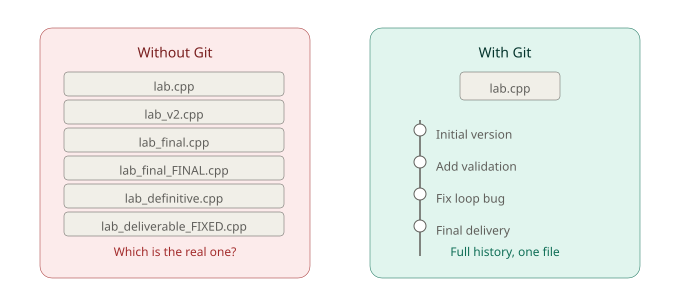

**No more `_final_FINAL_v2`. Just commits.**

[↑ Back to contents](#contents)

---

## 3. Create your GitHub account

> 🔧 **Your turn:** create your GitHub account now.

### Step 1: Sign up

1. Go to [github.com](https://github.com).
2. Click **Sign up**.
3. **Use your institutional email** (`@upf.edu`). This is important for the next step.
4. Choose a username. Recommendation: something professional and recognizable (e.g. your name or student ID).
5. Complete the verification and confirm your email.

### Step 2: Apply for the GitHub Student Developer Pack (optional)

GitHub offers a free upgrade for verified students with access to GitHub Pro and partner developer tools. It is **not required** for this course, but worth applying for.

1. Go to [education.github.com/pack](https://education.github.com/pack).
2. Click **Get your Pack** and verify your academic status using your `@upf.edu` email.

Approval may take a few days. See [section D in Additional Material](#d-github-student-developer-pack-benefits) for a full list of benefits.

[↑ Back to contents](#contents)

---

## 4. Install Visual Studio Code

> 🔧 **Your turn:** install VS Code on your computer.

Visual Studio Code (VS Code) is a free code editor. We will use it to write and edit code.

### Windows

1. Go to [code.visualstudio.com](https://code.visualstudio.com/).
2. Download the Windows installer (`.exe`).
3. Run the installer. **Check "Add to PATH"** during setup (this is important).
4. Launch VS Code.

### macOS

1. Go to [code.visualstudio.com](https://code.visualstudio.com/).
2. Download the macOS version (`.zip`).
3. Unzip it and drag **Visual Studio Code.app** into your **Applications** folder.
4. Launch VS Code.

### Linux (Ubuntu / Debian)

Open a terminal and run:

```bash
sudo snap install --classic code
```

Or download the `.deb` package from [code.visualstudio.com](https://code.visualstudio.com/) and install it:

```bash
sudo dpkg -i code_*.deb
```

[↑ Back to contents](#contents)

---

## 5. Install Git

> 🔧 **Your turn:** install Git on your computer and verify the installation.

Git is the command-line tool that tracks your project history. We need to install it and configure your identity.

### Windows

1. Go to [git-scm.com](https://git-scm.com/).
2. Download the Windows installer and run it.
3. During setup, keep the default options. Make sure **"Git from the command line and also from 3rd-party software"** is selected.
4. Once installed, open **Git Bash** (it appears in your Start menu).

### macOS

Open a terminal and run:

```bash
git --version
```

If Git is not installed, macOS will prompt you to install the Xcode Command Line Tools. Accept and wait for the installation to finish.

Alternatively, install via Homebrew:

```bash
brew install git
```

### Linux (Ubuntu / Debian)

```bash
sudo apt update && sudo apt install git
```

### Configure your identity (all platforms)

After installing, open a terminal (or Git Bash on Windows) and run:

```bash
git config --global user.name "Your Full Name"
git config --global user.email "your_email@upf.edu"
```

This tells Git who you are. Every commit you make will be tagged with this name and email.

### Set the default branch name (all platforms)

```bash
git config --global init.defaultBranch main
```

This ensures new repositories use `main` as the default branch name (matching GitHub). Older Git versions use `master` by default, which causes mismatches.

> **Troubleshooting:** if Git shows a warning about "pull strategy" when you run `git pull`, run this once to silence it:
>
> ```
> git config --global pull.rebase false
> ```

### Authentication with GitHub

When you run `git push` for the first time, Git needs to verify your GitHub identity. GitHub does **not** accept your account password for terminal operations.

The first time you push, Git will open a browser window asking you to log in to GitHub. Follow the prompts and authorize access. After that, your credentials are stored and you will not be asked again.

> **If the browser prompt does not appear**, see [section E in Additional Material](#e-authentication-troubleshooting) for platform-specific solutions.

### Verify Git is installed

Open a terminal (or Git Bash on Windows) and type:

```bash
git --version
```

You should see something like `git version 2.45.0`. If you get an error, Git is not installed correctly.

---

### ✅ Pre-session checklist

Before coming to class, make sure you have:

- [ ] A GitHub account created with your `@upf.edu` email
- [ ] Applied for the GitHub Student Developer Pack
- [ ] Visual Studio Code installed
- [ ] Git installed (verified that `git --version` works in your terminal)


***NEXT:***
> **Course materials:** the full version of this course, including all diagrams and hands-on exercises, is available at: [https://github.com/alberthp/Micro-course-Introduction-to-Git-GitHub](https://github.com/alberthp/Micro-course-Introduction-to-Git-GitHub). Part 2 (hands-on session) will follow that manual step by step.


[↑ Back to contents](#contents)

---

# Part 2: Hands-on session (in class)

> **Windows users:** all terminal commands in this course must be run in **Git Bash** (installed with Git in section 5), not in Command Prompt (cmd.exe) or PowerShell. Git Bash understands Unix paths like `~/Documents/`.

> 🔧 **First step:** before creating your own repository, go to the course repository on GitHub and click the **Fork** button (top right). This creates a copy of the course materials in your own GitHub account. You will then clone from your own fork, not from the instructor's account. This is how open-source collaboration works: fork first, then clone your fork.

---

## 6. Create a private repository

> 🔧 **Your turn:** create your own private repository on GitHub.

You will create your own repository on GitHub. Each student creates their own.

### Naming convention

Your repository must be named: **`IntroGit_Uxxx`**

Replace `Uxxx` with your student U-number. Example: `IntroGit_U123456`.

### Steps on GitHub

1. Log in to [github.com](https://github.com).
2. Click the **`+`** button (top right corner), then **New repository**.

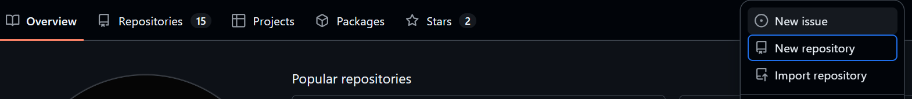

1. Fill in the form:

| Field | Value |
| ------- | ------- |
| Repository name | `IntroGit_Uxxx` (your U-number) |
| Description | `Introduction to Git - class exercise` |
| Visibility | 🔘 **Private** |
| Add a README file | ☑ **Check this box** |
| .gitignore template | None (see [section A](#a-the-gitignore-file-what-not-to-track) in Additional Material) |
| License | None |

1. Click **Create repository**.

You now have a remote repository on GitHub with one file (`README.md`).

[↑ Back to contents](#contents)

---

## 7. Invite a classmate as collaborator

> 🔧 **Your turn:** invite a classmate to your repository, and accept their invitation to theirs.

You will work in pairs. Invite a classmate to your repository.

1. Go to your repository page on GitHub.
2. Click **Settings** (tab at the top).
3. In the left sidebar, click **Collaborators**.
4. Click **Add people**.
5. Type your classmate's GitHub username or their `@upf.edu` email.
6. Select them and click **Add**.
7. Your classmate will receive an email invitation. They must accept it.

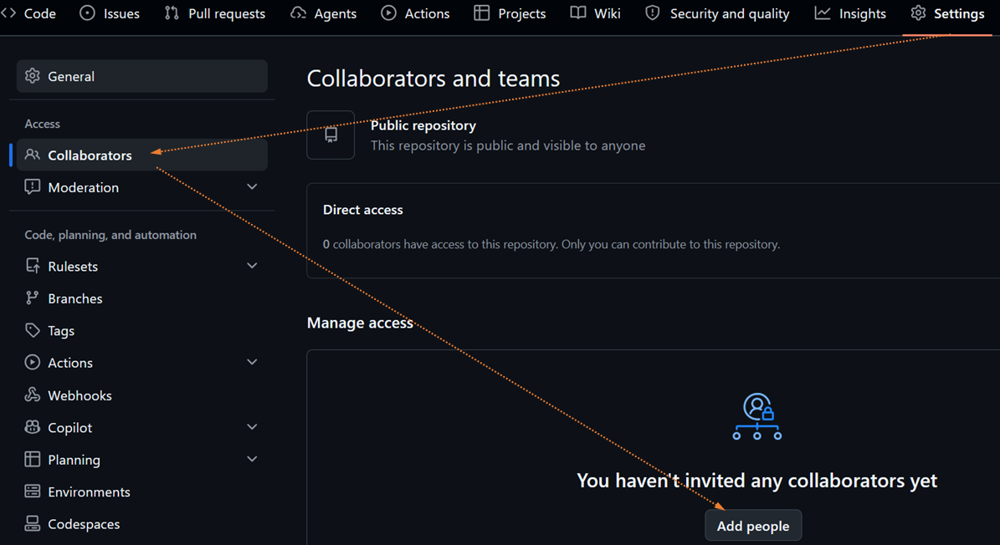

> Both students do this: you invite your classmate to yours, and they invite you to theirs. You will work on **your own** repository for now.

[↑ Back to contents](#contents)

---

## 8. Folder structure of a Git project

Professional projects follow a standard folder layout. Here is a typical structure:

```
my-project/
├── README.md            ← Project description (this is the "front page")
├── LICENSE              ← Legal terms for code reuse
├── .gitignore           ← List of files Git should ignore
├── src/                 ← Source code
│   ├── index.html
│   ├── style.css
│   └── app.js
├── tests/               ← Automated tests
│   └── test_app.js
└── docs/                ← Documentation
    └── guide.md
```

**Key files:**

| File / Folder | Purpose |
| --------------- | --------- |
| `README.md` | Explains what the project does and how to use it. GitHub displays it automatically on the repo page |
| `.gitignore` | Tells Git to skip certain files (temporary files, build outputs, secrets). Without this, you risk uploading files that should stay local |
| `src/` | Contains all source code |
| `tests/` | Contains tests that verify the code works |
| `docs/` | Extended documentation |

For today's exercise, we keep it simple: just `README.md` and an `index.html`.

[↑ Back to contents](#contents)

---

## 9. Download a local copy (clone)

> 🔧 **Your turn:** clone your repository to your computer.

Cloning means downloading the remote repository to your computer, including its full history.

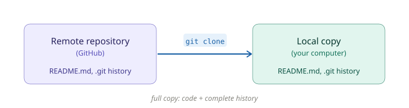

Open a terminal, navigate to the folder where you want the project, and run:

```bash
mkdir -p ~/Documents/git-projects
cd ~/Documents/git-projects
git clone https://github.com/YOUR_USERNAME/IntroGit_Uxxx.git
cd IntroGit_Uxxx
```

Replace `YOUR_USERNAME` with your GitHub username.

### What happened?

A new folder named `IntroGit_Uxxx` appeared on your computer. Inside it you will find the `README.md` file and a hidden `.git` folder (this is where Git stores the history).

Run this command to see where your clone points to:

```bash
git remote -v
```

You will see something like:

```
origin  https://github.com/YOUR_USERNAME/IntroGit_Uxxx.git (fetch)
origin  https://github.com/YOUR_USERNAME/IntroGit_Uxxx.git (push)
```

`origin` is the nickname Git gave to your GitHub repository URL. Every time you run `git push` or `git pull`, Git uses this URL.

To get this URL from GitHub, click the green **Code** button on your repository page and copy the HTTPS URL:

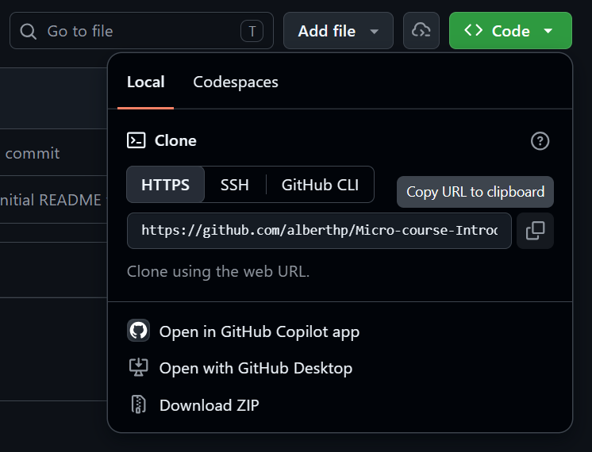<br>

This text will now appear on a new line.

```
IntroGit_Uxxx/
├── .git/        ← Hidden folder with the full history (do not touch)
└── README.md    ← The file from GitHub
```

[↑ Back to contents](#contents)

---

## 10. The Git pipeline: how changes travel

This is the most important concept. Every change you make goes through a specific pipeline before it reaches GitHub.

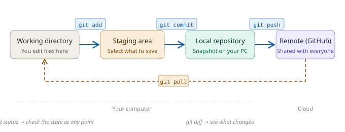

### What each step does

| Step | Command | What it does | Why it exists |
| ------ | --------- | ------------- | --------------- |
| **1. Edit** | (just edit files) | You modify, create, or delete files in your local project folder | This is where you work |
| **2. Stage** | `git add` | Marks which changes will be included in the next snapshot | Sometimes you change 5 files but only want to save 2 right now |
| **3. Commit** | `git commit` | Records a new version in your local Git history. This is not the same as saving a file in your editor. The commit is only local until you push it | Creates a checkpoint you can return to later |
| **4. Push** | `git push` | Uploads your local commits to GitHub | Makes your work visible to collaborators and backs it up |

> **Important:** If you only edit a file and do nothing else, the change stays only on your computer and is NOT saved in Git history. You must `add`, `commit`, and `push`.

### The reverse direction

To download changes made by others (or from another computer), use `git pull`. This command downloads new commits from GitHub and merges them into your local copy. The dashed arrow in the diagram above shows this reverse flow.

[↑ Back to contents](#contents)

---

## 11. Create your first file

> 🔧 **Your turn:** create this file in your project and test it in your browser.

We will create a simple HTML file. HTML does not require installing anything: you can open it directly in a web browser.

### Step 1: Create the file

Open VS Code. Open your project folder (`IntroGit_Uxxx`). Create a new file named `index.html` with this content:

```html
<!DOCTYPE html>
<html lang="en">
<head>
    <meta charset="UTF-8">
    <title>My First Git Project</title>
</head>
<body>
    <h1>Hello World!</h1>
    <p>This is my first file tracked by Git.</p>
    <p>Author: YOUR NAME HERE</p>
</body>
</html>
```

Replace `YOUR NAME HERE` with your actual name.

### Step 2: Test it locally

Open `index.html` in your web browser (double-click the file or drag it into the browser). You should see a page that says "Hello World!".

[↑ Back to contents](#contents)

---

## 12. Your first commit and push

> 🔧 **Your turn:** follow these steps to push your file to GitHub.

> **Tip:** you can use the integrated terminal inside VS Code (menu: Terminal > New Terminal, or `` Ctrl+` ``). This way you have your code editor and the terminal side by side in a single window.

Now let's send the new file to GitHub, step by step.

### Using the terminal

**Step 1: Check the current state**

```bash
git status
```

You will see something like:

```
Untracked files:
  (use "git add <file>..." to include in what will be committed)
        index.html
```

This means Git sees a new file but is **not tracking it yet**. You need to tell Git to start tracking it.

**Step 2: Stage the file**

```bash
git add index.html
```

Run `git status` again:

```
Changes to be committed:
        new file:   index.html
```

The file is now staged (ready to be included in the next commit). Staging is like putting items in a box before sealing it.

**Step 3: Commit (record a version)**

```bash
git commit -m "Add index.html with Hello World page"
```

The `-m` flag lets you write a short message describing what you did. This message will appear in the project history, so **always write a meaningful message** that explains what changed and why.

Good messages:

- `"Add index.html with Hello World page"`
- `"Fix typo in author name"`
- `"Add navigation menu to index.html"`

Bad messages:

- `"update"`
- `"stuff"`
- `"asdfgh"`
- `"final version"`

**Step 4: Push to GitHub**

```bash
git push -u origin main
```

- `origin` is the nickname for your remote repository on GitHub.
- `main` is the name of the branch (we will talk about branches later).
- `-u` links your local `main` branch to `origin/main`. For all future pushes on this branch, you only need to type `git push`.

After this command, your code is on GitHub. Anyone with access to the repository can now see it.

> **Note:** we are pushing directly to `main` for now to keep things simple. In section 15 you will learn why this is not recommended and how to use branches instead.

**Step 5: Verify on GitHub**

Go to your repository page on GitHub and refresh. You should see `index.html` listed alongside `README.md`.

> **Git vs GitHub in action:** the commit existed only on your computer until you pushed it. Git (local) recorded the version; GitHub (remote) now hosts it. These are two separate steps by design.

[↑ Back to contents](#contents)

---

## 13. Modify, diff, and commit again

> 🔧 **Your turn:** edit your file and use `git diff` to inspect the changes.

Now let's modify the file and use `git diff` to see exactly what changed.

### Step 1: Edit the file

Open `index.html` in VS Code. Add a new line inside `<body>`:

```html
<body>
    <h1>Hello World!</h1>
    <p>This is my first file tracked by Git.</p>
    <p>Author: YOUR NAME HERE</p>
    <p>This line was added in commit 2.</p>
</body>
```

Save the file.

### Step 2: See the difference

Before committing, you can see exactly what changed:

```bash
git diff
```

> **First time using `git diff`?** The output opens in a pager (a scrollable viewer). Use the arrow keys to scroll, and press **`q`** to exit and return to the terminal. This happens every time the output is longer than your terminal window.

Output:

```diff
diff --git a/index.html b/index.html
--- a/index.html
+++ b/index.html
@@ -7,5 +7,6 @@
     <h1>Hello World!</h1>
     <p>This is my first file tracked by Git.</p>
     <p>Author: YOUR NAME HERE</p>
+    <p>This line was added in commit 2.</p>
 </body>
 </html>
```

- Lines starting with `+` are **additions** (new content).
- Lines starting with `-` are **deletions** (removed content).
- Lines without a prefix are **context** (unchanged, shown for reference).

After staging a file, `git diff` shows nothing (the changes are no longer "unstaged"). To verify this, stage the file first and then compare:

```bash
git add index.html
git diff              # shows nothing (changes are now staged)
git diff --staged     # shows the staged changes
```

This distinction helps you understand why `git add` exists: it lets you choose exactly which changes go into the next commit.

VS Code also shows diffs visually: click the file name in the Source Control panel (left sidebar) to see green (added) and red (removed) highlights.

[↑ Back to contents](#contents)

---

## 14. Practice: complete the pipeline yourself

> 🔧 **Your turn:** complete the full pipeline on your own, without looking at the previous section.

Now it is your turn. Push the modification you just made by repeating the full pipeline:

```bash
git status          # 1. See what changed
git add .           # 2. Stage all eligible changes (respecting .gitignore rules)
git commit -m "Add second paragraph to index.html"   # 3. Commit
git push                                              # 4. Push to GitHub (no need for "origin main" after -u)
```

Verify on GitHub that your repository now shows the updated file with your new line.

### Check the commit history

You can see all your commits so far:

```bash
git log --oneline
```

Output:

```
b3d7f2a Add second paragraph to index.html
a1c9e4d Add index.html with Hello World page
f0e2d1b Initial commit
```

Each line is one commit, with its unique ID (the letters and numbers on the left) and your message.

On GitHub, click the **"commits"** link (or the clock icon) on your repository page to see the same history in the browser.

[↑ Back to contents](#contents)

---

## 15. Branches

### The problem: working directly on `main`

Right now, all your commits go to the `main` branch. This is the **stable, official version** of your project. Imagine two people editing `main` at the same time:

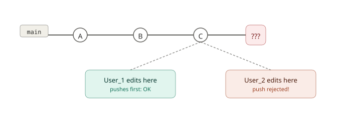

- User_1 pushes first: no problem.
- User_2 tries to push: **rejected**, because `main` moved forward without him.
- If they edited the same lines, User_2 must now solve conflicts on top of unfinished work.

**Strong recommendation: do not work directly on `main`.** In this course, we will always use branches. In professional projects, `main` is typically protected and all changes go through branches and Pull Requests.

### What is a branch?

A branch is an **independent line of development**. It lets you make commits without changing the `main` branch. When your work is ready, you merge the branch back into `main`.

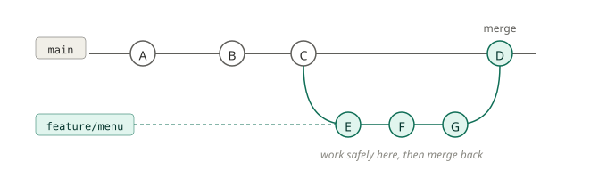

- `main` stays stable while you work.
- Your branch (`feature/menu`) has your experimental changes.
- When the feature is ready, you merge it into `main`.

### Branch naming conventions

| Prefix | Usage | Example |
| -------- | ------- | --------- |
| `feature/` | New functionality | `feature/navigation-menu` |
| `fix/` | Bug fix | `fix/broken-link` |
| `docs/` | Documentation changes | `docs/update-readme` |

### Practice: create and use a branch

> 🔧 **Your turn:** follow all seven steps below on your own repository.

**Step 1: Create a new branch and switch to it**

```bash
git switch -c feature/add-menu
```

This creates a branch called `feature/add-menu` and switches to it. You are no longer on `main`.

- `switch` is the command for changing branches.
- `-c` means "create" (create the branch and switch to it in one step).

> **Older syntax:** in many tutorials and online answers you will see `git checkout -b feature/add-menu`, which does the same thing. We use `git switch` because it is the modern, dedicated command for switching branches. `git checkout` is still valid but is also used for other purposes (like restoring files), which can be confusing.

**Step 2: Verify which branch you are on**

```bash
git branch
```

Output:

```
* feature/add-menu
  main
```

The `*` indicates your current branch.

> **Important:** this new branch exists **only on your computer** for now. It will appear on GitHub only after you push it (step 5). Until then, your classmates cannot see it.

**Step 3: Edit the code on your branch**

Open `index.html` and add a navigation menu:

```html
<body>
    <nav>
        <a href="#">Home</a> |
        <a href="#">About</a> |
        <a href="#">Contact</a>
    </nav>
    <h1>Hello World!</h1>
    <p>This is my first file tracked by Git.</p>
    <p>Author: YOUR NAME HERE</p>
    <p>This line was added in commit 2.</p>
</body>
```

**Step 4: Commit on your branch**

```bash
git add .
git commit -m "Add navigation menu"
```

This commit exists **only** on the branch `feature/add-menu`. The `main` branch is untouched.

**Step 5: Push the branch to GitHub**

```bash
git push -u origin feature/add-menu
```

Let's break down each part of this command:

- `git push`: send commits from your local repository to the remote.
- `-u` (or `--set-upstream`): links your local branch to the remote branch so Git remembers the connection. After this, you only need `git push`.
- `origin`: the nickname for your remote repository on GitHub (set automatically when you cloned).
- `feature/add-menu`: the name of the branch you are pushing. This creates the branch on GitHub if it does not exist yet.

Review in your repository web that, now, there are two branches:

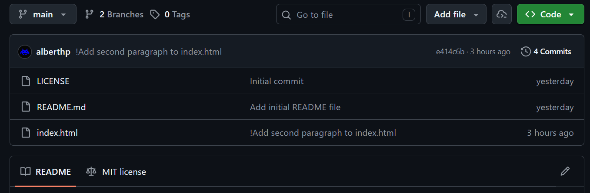<br>

**Step 6: Merge the branch into `main`**

If desired, in GitHub web, you can review changes of the branch with respect `main`, use the "Compare & pull request" button:

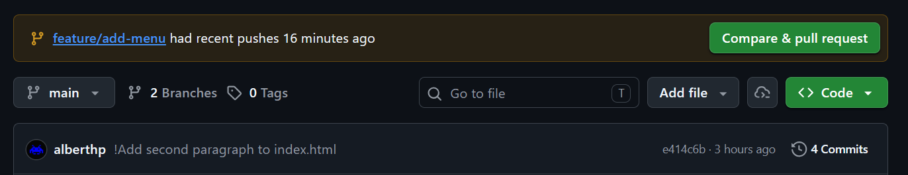<br>

Then, you will be able to review changes directly applied to code:

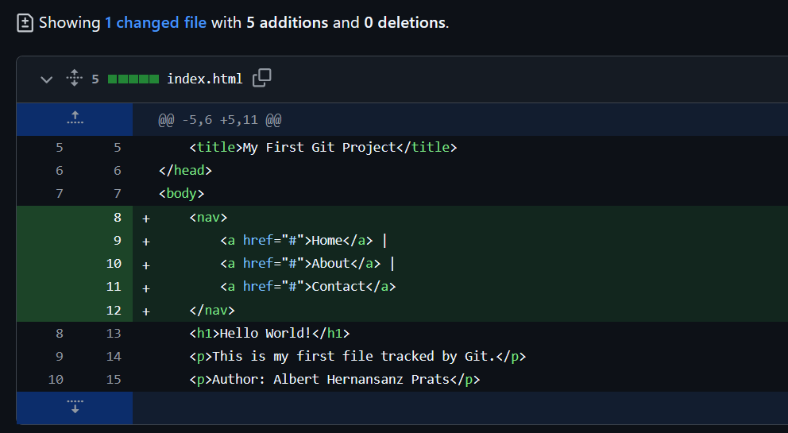<br>

Once you are happy with the changes, bring them into `main`:

```bash
git switch main             # switch back to main
git pull                    # get any remote changes first
git merge feature/add-menu  # bring the branch changes into main
git push                    # push the updated main to GitHub
```
Move to GitHub web, in `main` branch, open `index.html` and changes must be there.

> **What happens during merge?** If nobody else changed `main` while you were on your branch, Git simply adds your commits on top (this is called a "fast-forward"). If `main` did change, Git creates a merge commit that combines both lines of work.

> **In professional teams:** instead of merging locally and pushing to `main`, developers open a **Pull Request (PR)** on GitHub. A PR lets teammates review the code, discuss changes, and approve before merging. Local merging (as we do here) teaches the core Git mechanics; Pull Requests add the collaboration layer on top.

**Step 7: (Optional) Delete the branch**

After merging, the branch has served its purpose. The branch can be deleted:

Before applying the following code, check in GitHub repo web that there are two branches.

```bash
git branch -d feature/add-menu          # delete locally
git push origin --delete feature/add-menu   # delete on GitHub
```

Now, check again the GitHub repo web and check that now, only main branch exists. If not, something has gone wrong. 

### Why this matters

| Without branches | With branches |
| ----------------- | --------------- |
| Everyone edits `main` directly | Each person works on their own branch |
| Broken code reaches `main` immediately | `main` stays stable at all times |
| Hard to undo a bad change | Bad changes stay on the branch, easy to discard |
| Confusing when multiple people work at once | Each person's work is isolated |

[↑ Back to contents](#contents)

---

## 16. Common problems

### Problem 1: Push rejected (remote is ahead)

You try to push your changes, but Git refuses with this error:

```
! [rejected]        main -> main (fetch first)
error: failed to push some refs to '...'
```
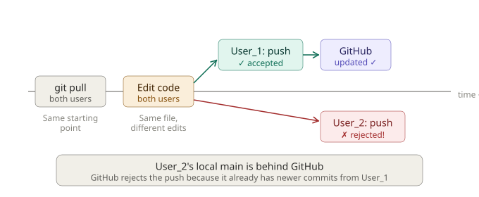

**Why:** Someone pushed changes to GitHub while you were working locally. Your local copy is behind.

**Solution:**

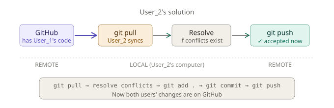

```bash
git pull    # download and merge the new changes
git push    # now push yours
```

### Problem 2: Forgot to pull before editing

You edited files locally, but the remote has newer commits. When you try to pull:

```
error: Your local changes to the following files would be overwritten by merge
```

**Solution:** Commit your local changes first, then pull:

```bash
git add .                                # stage your current changes
git commit -m "Save my work before pulling"   # save them as a local commit
git pull                                 # now pull the remote changes
```

### Problem 3: Recovering a previous version

If you need to see or restore a previous version of a file:

```bash
# See the history
git log --oneline

# See a specific old version of a file (does NOT change your current file)
git show abc1234:index.html

# Restore a file to a previous version
git restore --source=abc1234 index.html
```

Replace `abc1234` with the commit ID from `git log`.

[↑ Back to contents](#contents)

---

## 17. Working with teams

Now you will work with the classmate you invited in section 7.

### 17.1 Verify the invitation

> 🔧 **Your turn (both students):** verify you have both repositories ready before continuing.

Both students should have:

- Their **own** repository (`IntroGit_Uxxx`) where they are the owner.
- An **invitation** to their classmate's repository where they are a collaborator.

If you have not invited anyone yet, go back to section 7 and do it now.

### 17.2 Clone your classmate's repository

> 🔧 **Your turn:** clone the repository your classmate invited you to.

You will now clone the repository that your classmate owns (the one they invited you to):

```bash
mkdir -p ~/Documents/git-projects
cd ~/Documents/git-projects
git clone https://github.com/CLASSMATE_USERNAME/IntroGit_Uyyy.git
cd IntroGit_Uyyy
```

You now have a local copy of their project.

> **Directory check:** you now have two projects inside `~/Documents/git-projects/`: your own (`IntroGit_Uxxx`) and your classmate's (`IntroGit_Uyyy`). Before running Git commands, check you are in the correct repository:
>
> ```
> pwd              # confirm the folder
> git remote -v    # confirm which GitHub repository this clone points to
> ```

### 17.3 One person modifies, the other syncs

> 🔧 **Your turn (coordinate with your classmate):** User_1 does the steps below first, then User_2 syncs.

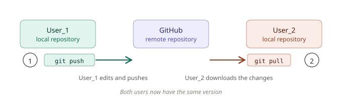

> **Before you start:** run `pwd` in your terminal to confirm you are inside the correct repository folder (`IntroGit_Uxxx`, not `IntroGit_Uyyy`).

**User_1** (the repository owner):

1. Create a branch and add a new section to `index.html`:

```bash
git switch -c feature/footer
```

Add this before `</body>`:

```html
    <footer>
        <p>© 2026 - Introduction to Programming, UPF</p>
    </footer>
```

1. Commit and push:

```bash
git add . # Stage all local changes (modified and new files) for the commit
git commit -m "Add footer section" # Save a local commit snapshot with a descriptive message
git push -u origin feature/footer # Upload the branch to GitHub and set upstream tracking
```

1. Merge into main:

```bash
git switch main # Switch back to the main branch
git pull # Download latest changes from GitHub to keep local main up to date
git merge feature/footer # Merge the feature/footer branch changes into main
git push # Upload the updated main branch to GitHub
```

**User_2** (the collaborator):

1. Download the latest changes:

```bash
git pull # Download and merge the latest changes from GitHub into your local branch
```

1. Open `index.html`. The footer that User_1 added is now in your local copy.

2. Compare with your previous version:

```bash
git log --oneline    # see the new commit from User_1
git log --oneline -2  # see the last two commits to verify User_1's changes
```

### 17.4 Generate and resolve a code conflict (Optional / Stretch Goal)

In this exercise, you and your classmate will practice handling a merge conflict: a standard situation in team development when two collaborators edit the same line of code at the same time.

Rather than treating conflicts as errors, you will learn that they are simply Git's way of asking for a human decision. Working in pairs as User_1 and User_2, you will intentionally: 1. create overlapping changes in `index.html`, 2. trigger the conflict during a merge, 3. use VS Code's visual tools to inspect and resolve the differences, 4. and push the unified final version to GitHub.

⚠️ **Precondition for this exercise** 
 
 1. Start aligned: Both users must begin with the exact same code version on `main`.
 2. User_1 acts, User_2 waits: User 1 creates a branch, modifies `index.html`, merges back to main, and pushes to GitHub. During this time, User_2 must remain paused and must NOT run `git pull`.
3. User_2 branches from the old state: User_2 creates a new branch from their local, outdated main and edits the exact same line.

> ❓ **Why this works:** Because User_2 branches from the original code without User_1's updates, both branches modify the same line from different points in history, forcing Git to flag a conflict during the merge.


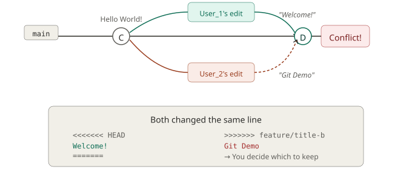

> 🔧 **Your turn (both students, step by step):** follow the instructions carefully. User_1 goes first, then User_2.
 
Now both students will edit the **same line** of the **same file** on different branches, creating a conflict.

**User_1** creates a branch and changes the page title:


```bash
git switch -c feature/title-a    # create a new branch and switch to it
```

Edit `index.html`, change the `<h1>`:

```html
    <h1>Welcome to our Project!</h1>
```

```bash
git add .                              # stage changes
git commit -m "Change title to Welcome message"   # commit locally
git push -u origin feature/title-a     # push branch to GitHub
git switch main                        # switch back to main
git pull                               # get latest remote changes
git merge feature/title-a              # merge the branch into main
git push                               # push updated main to GitHub
```

**User_2** creates a different branch and changes the **same line** (User_2 has NOT pulled User_1's changes yet, which is what will cause the conflict):


```bash
git switch -c feature/title-b
```

Edit `index.html`, change the `<h1>`:

```html
    <h1>Git & GitHub Demo Page</h1>
```

```bash
git add .                               # Stage the modified index.html for commit
git commit -m "Change title to Git demo" # Save the change to the feature/title-b branch history
git push -u origin feature/title-b      # Upload the feature/title-b branch to GitHub and set tracking
```


Now User_2 tries to merge. First, make sure all changes on your branch are committed (run `git status` and verify it shows "nothing to commit, working tree clean"). If you have uncommitted changes, Git will block the branch switch. Then:

```bash
git switch main
git pull                   # get User_1's changes first
git merge feature/title-b
```

**Git reports a conflict:**

```
Auto-merging index.html
CONFLICT (content): Merge conflict in index.html
Automatic merge failed; fix conflicts and then commit the result.
```

**What the file looks like now:**

```html
<<<<<<< HEAD
    <h1>Welcome to our Project!</h1>
=======
    <h1>Git & GitHub Demo Page</h1>
>>>>>>> feature/title-b
```

**How to read this:**

| Marker | Meaning |
| -------- | --------- |
| `<<<<<<< HEAD` | Start of the version currently in `main` |
| `=======` | Separator between the two versions |
| `>>>>>>> feature/title-b` | End of the version from your branch |

**How to resolve it: (User 2)**

1. Open `index.html` in VS Code. Because the file contains conflict markers (`<<<<<<<`, `=======`, `>>>>>>>`), VS Code **automatically** detects the conflict and highlights the two versions with colored backgrounds (green for your current branch, blue for the incoming branch). No extension is needed, this is a built-in feature. You will also see clickable text buttons above the conflict: **Accept Current Change**, **Accept Incoming Change**, and **Accept Both Changes**.
2. **Decide** which version to keep. You have two options:
   - **Click one of the buttons** (fastest): VS Code removes the conflict markers and keeps the version you chose.
   - **Edit manually**: delete the markers yourself and write the final version. This is useful when you want to combine both changes. For example:

```html
    <h1>Welcome to our Git & GitHub Demo!</h1>
```

3. If you edited manually, make sure you have **deleted** all the conflict markers (`<<<<<<<`, `=======`, `>>>>>>>`). No markers should remain in the file.
4. Save the file.
5. Complete the merge:

```bash
git add index.html
git commit -m "Resolve title conflict: combine both versions"
git push
```


**Key takeaway:** Conflicts are not errors. They are Git asking you to make a decision because two people changed the same thing. Read the markers, choose the correct code, remove the markers, and commit.

[↑ Back to contents](#contents)

---

## Summary: essential commands

| Command | What it does |
| --------- | ------------- |
| `git clone <url>` | Download a remote repository to your computer |
| `git status` | Show which files have changed |
| `git add .` | Stage all changes for the next commit |
| `git commit -m "message"` | Record a version in local Git history with a description |
| `git push -u origin main` | Upload your commits to GitHub (first time; then just `git push`) |
| `git pull` | Get changes from the remote and integrate them into your current branch |
| `git log --oneline` | Show commit history (compact) |
| `git diff` | Show what changed since the last commit |
| `git branch` | List all branches |
| `git switch -c name` | Create a new branch and switch to it |
| `git switch main` | Switch back to main |
| `git merge name` | Merge a branch into the current branch |

[↑ Back to contents](#contents)

---

## Good practices

1. **Do not work directly on `main`.** Always create a branch. In professional projects, `main` is protected and changes go through branches and Pull Requests.
2. **Write meaningful commit messages.** Your future self (and your classmates) will thank you.
3. **Commit often.** Small, focused commits are easier to understand and to undo.
4. **Keep shared branches up to date.** Before pushing to a shared branch (like `main`), run `git pull` to integrate any remote changes first.
5. **Do not track generated files.** Use `.gitignore` to exclude build outputs, temporary files, and IDE configuration.
6. **Review your changes before committing.** Use `git diff` or the VS Code Source Control panel.

---

> **End of the micro-course.** You now know how to create a repository, track changes, work with branches, collaborate with others, and resolve conflicts. These are the foundations you will use in every programming project from now on.

[↑ Back to contents](#contents)

---

# Additional material

---

## A. The `.gitignore` file: what NOT to track

Not every file in your project folder belongs in the repository. Some files are generated automatically, are specific to your computer, or contain sensitive information. If you push them to GitHub, you pollute the repository with unnecessary data and risk sharing secrets.

The `.gitignore` file tells Git which files and folders to ignore. Git will not track them, will not stage them, and will not push them.

### Example: a Python project

Imagine you create a virtual environment for a Python project:

```bash
python -m venv .venv
```

This creates a `.venv/` folder with hundreds of files (the Python interpreter, installed packages, etc.). This folder can weigh 200 MB or more, is specific to your operating system, and can be recreated at any time with `pip install`. It should **never** be pushed to GitHub.

Create a file named `.gitignore` in the root of your project with this content:

```
# Virtual environment
.venv/

# Python compiled files
__pycache__/
*.pyc

# IDE configuration
.vscode/
.idea/

# Operating system files
.DS_Store
Thumbs.db

# Environment variables and secrets
.env
```

### How it works

| Pattern | What it ignores |
| --------- | ---------------- |
| `.venv/` | The entire virtual environment folder |
| `__pycache__/` | Python's compiled bytecode cache |
| `*.pyc` | Any individual compiled Python file |
| `.vscode/` | VS Code workspace settings (personal to each developer) |
| `.idea/` | JetBrains IDE settings |
| `.DS_Store` | macOS folder metadata |
| `Thumbs.db` | Windows thumbnail cache |
| `.env` | File often used to store secrets or local configuration |

### What happens without a `.gitignore`

```bash
git add .
git status
```

```
Changes to be committed:
        new file:   .venv/bin/python3          ← 200 MB of binaries
        new file:   .venv/lib/site-packages/...← thousands of files
        new file:   .env                       ← your passwords!
        new file:   index.html                 ← the only file you actually want
```

### What happens with a `.gitignore`

```bash
git add .
git status
```

```
Changes to be committed:
        new file:   index.html                 ← only your code
```

> **Rule of thumb:** if a file can be regenerated (compiled code, installed packages, build outputs) or is personal to your machine (IDE settings, OS metadata), it goes in `.gitignore`. Never commit secrets in the first place. `.gitignore` helps prevent accidental commits, but it does not remove secrets already in Git history. If a secret is accidentally committed, revoke it immediately and generate a new one.

> **Tip:** GitHub offers ready-made `.gitignore` templates for most languages. When you create a repository (section 6), you can select one from the dropdown. For Python projects, choose the **Python** template.

### What if I already committed files I should have ignored?

`.gitignore` only affects **untracked** files. If you already committed `.venv/` or `.DS_Store` before creating your `.gitignore`, Git will continue tracking them even after you add them to `.gitignore`.

To fix this, remove them from Git's tracking (without deleting them from your computer):

```bash
git rm -r --cached .venv/
git rm --cached .DS_Store
git commit -m "Stop tracking files that should be ignored"
```

The `--cached` flag removes the files from Git's index only. Your local files stay untouched. From this point on, `.gitignore` will prevent them from being tracked again.

---

## B. GitHub Desktop and VS Code extensions

If you prefer a graphical interface over the terminal, two tools can help.

### GitHub Desktop

GitHub Desktop is a free application that provides a visual interface for Git. Instead of typing commands, you click buttons to clone, commit, push, pull, and manage branches.

1. Download it from [desktop.github.com](https://desktop.github.com/) (Windows and macOS only).
2. Sign in with your GitHub account.
3. All the terminal commands in this course have a visual equivalent in GitHub Desktop.

GitHub Desktop is a good starting point, but learning the terminal commands gives you more control and works on any platform (including Linux and remote servers).

### VS Code GitHub extension

VS Code has a built-in Git panel (Source Control, in the left sidebar) that already shows changes, diffs, and lets you commit. For deeper GitHub integration:

1. Open VS Code.
2. Go to Extensions (`Ctrl+Shift+X`).
3. Search for **GitHub Pull Requests and Issues** and install it.

This extension lets you manage pull requests, review code, and browse issues directly inside the editor.

---

## C. Cross-platform line endings (CRLF vs LF)

Windows uses CRLF line endings, while macOS and Linux use LF. When collaborating across operating systems, Git may mark every line as changed even if the content is identical.

To prevent this, configure Git once:

On **Windows:**

```bash
git config --global core.autocrlf true
```

On **macOS / Linux:**

```bash
git config --global core.autocrlf input
```

This tells Git to normalize line endings automatically when staging files.

---

## E. Authentication troubleshooting

If the automatic browser authentication does not work when you first run `git push`, use one of these platform-specific solutions:

**Windows:** Git Credential Manager should be installed with Git (from [git-scm.com](https://git-scm.com/)). If prompted for a username/password instead of a browser window, reinstall Git and make sure "Git Credential Manager" is selected during setup.

**macOS:** If credentials are not stored automatically, run:

```bash
git config --global credential.helper osxkeychain
```

**Linux:** Install the GitHub CLI and configure Git to use it:

```bash
sudo apt install gh
gh auth login
gh auth setup-git
```

Follow the prompts for `gh auth login` (select GitHub.com, HTTPS, and authenticate via browser). The second command configures Git to use your GitHub credentials for `git push` and `git pull`.

**Alternative (all platforms):** create a Personal Access Token (PAT) on GitHub (Settings > Developer settings > Personal access tokens) and use it as your password when Git prompts for credentials.

---

## F. Pull Requests on GitHub

In the core course, we merge branches locally using `git merge`. In professional workflows, merging is done through **Pull Requests (PRs)** on GitHub, which add a review step before changes reach `main`.

### What is a Pull Request?

A Pull Request is a GitHub feature (not a Git feature) that says: "I have changes on a branch. Please review them before merging into `main`."

### Step-by-step: creating a Pull Request

1. Push your branch to GitHub:

```bash
git push -u origin feature/add-menu
```

1. Go to your repository on GitHub. You will see a banner: **"feature/add-menu had recent pushes. Compare & pull request."** Click it.

2. Fill in the PR form:
   - **Title:** a short description of the changes (e.g. "Add navigation menu").
   - **Description:** explain what you changed and why.
   - **Reviewers:** (optional) select a classmate to review.

3. Click **Create pull request**.

4. Your classmate (or you, for practice) reviews the changes on GitHub: the PR page shows the diff, and reviewers can leave comments on specific lines.

5. When approved, click **Merge pull request** on GitHub, then **Confirm merge**.

6. The branch is now merged into `main` on GitHub. Pull the updated `main` locally:

```bash
git switch main
git pull
```

### Why use Pull Requests?

| Local merge (`git merge`) | Pull Request (GitHub) |
| -------------------------- | ---------------------- |
| Fast, done in terminal | Adds a review step before merging |
| No record of who approved | Comments and approvals are visible |
| Good for solo work | Standard for team projects |

> **Recommendation:** once you are comfortable with branches and merging, start using Pull Requests for your team projects. It is the standard workflow in professional software development.

---

## G. Advanced recovery commands

These commands are useful but involve concepts (`HEAD`, index, history rewriting) that go beyond the introductory course. Use them carefully.

### Undo the last commit (before pushing)

If you committed something you should not have, and you have **not pushed yet**:

```bash
git reset --soft HEAD~1
```

This undoes the last commit but keeps your changes staged. You can then edit and recommit. `HEAD~1` means "one commit before the current one."

**If you already pushed, do not rewrite history.** Instead, make a new commit that fixes the problem.

### Restore a file using `git checkout` (older syntax)

The older way to restore a file to a previous version:

```bash
git checkout abc1234 -- index.html
```

This does the same as `git restore --source=abc1234 index.html`. The modern `git restore` is preferred because `git checkout` is used for many different things (switching branches, restoring files), which can be confusing.

---

## D. GitHub Student Developer Pack benefits

When approved, the Student Developer Pack includes (as of 2026):

| Benefit | What it does |
| --------- | ------------- |
| GitHub Pro | Unlimited private repositories, advanced features |
| GitHub Copilot | AI code assistant integrated in your editor |
| JetBrains licenses | Professional IDEs (PyCharm, CLion, etc.) |
| Cloud credits | AWS, Azure, DigitalOcean free tiers |

Benefits may change over time. See [education.github.com/pack](https://education.github.com/pack) for the current list.

[↑ Back to contents](#contents)
